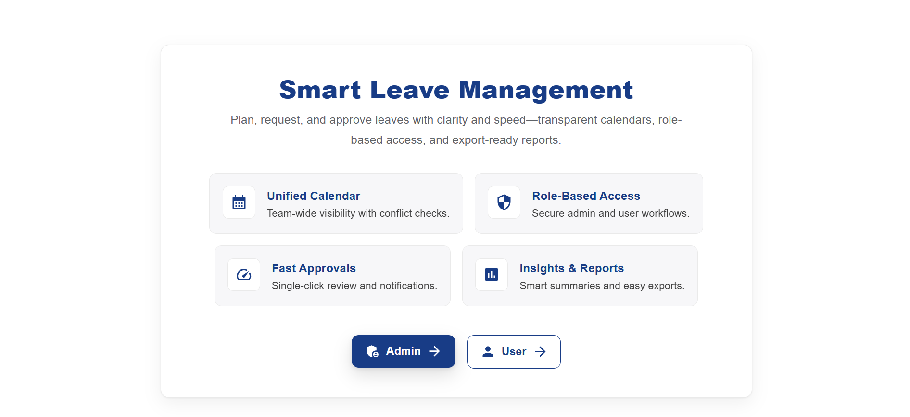
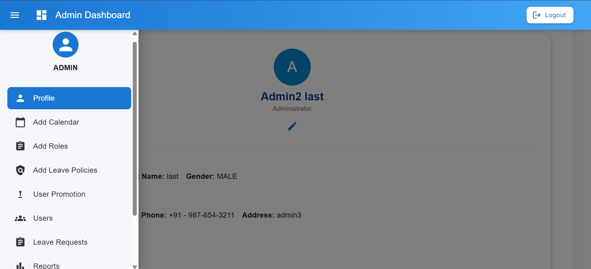
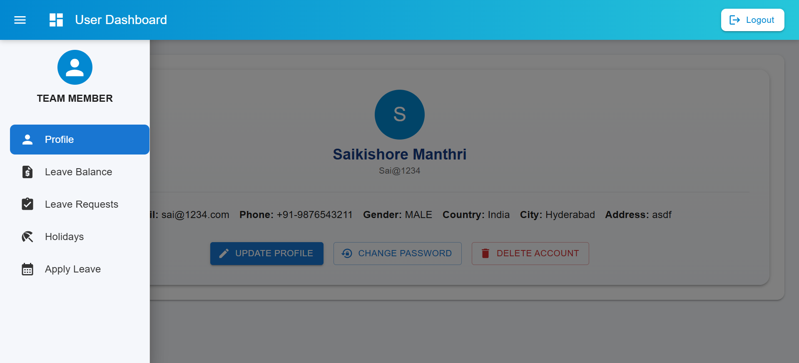
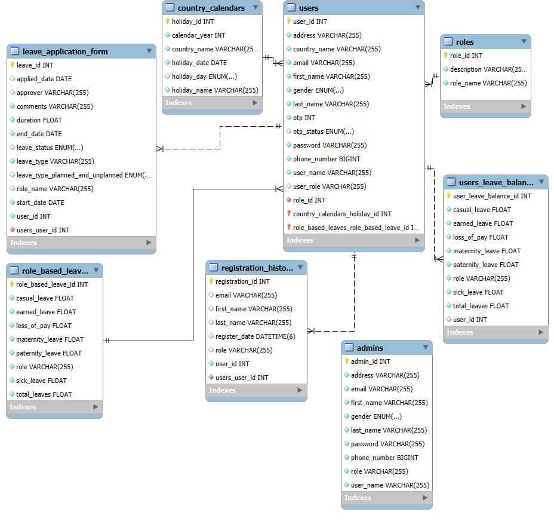

# 🚀 Smart Leave Management System (SLMS)

> A secure, web-based full-stack platform designed to streamline and automate all organizational leave-related activities. SLMS enforces a structured approval workflow based on reporting hierarchy, ensuring compliance with company-specific leave policies and providing robust analytics for efficient resource planning.


-----

## ✨ Key Features & Modules

SLMS is structured into powerful modules providing comprehensive functionality for all user types.

### 💼 Admin Module (Full Control)

  * **System Configuration:** Full control over global system settings, user roles, and leave policies.
  * **Approval & Rejection:** Centralized access to approve or reject all pending leave requests.
  * **User Management:** Manage, add, delete, and update user accounts and assign roles.
  * **Policy & Calendar Management:** Configure organization-specific leave policies (e.g., Sick, Casual, Earned) and maintain the official holiday calendar (including bulk Excel sheet upload/update).
  * **Reporting & Analytics:** Access to leave reports, monitoring leave trends, and viewing team availability.

### 👤 User Module (Multi-Role Support)

The system supports a distinct hierarchy of roles, each with specific permissions: **HR Manager**, **Team Manager**, **Team Lead**, and **Team Member**.

  * **Easy Leave Application:** Employees can apply for leaves with a few clicks, specifying dates, type, and reason.
  * **History & Status:** View personal leave history, current leave balance, and the real-time status of submitted requests.
  * **Approval Access:** HR Managers and Team Managers possess the necessary permissions to approve and reject requests from their subordinates.
  * **Notifications:** Receive instant notifications regarding the decision on a leave request.

### 📝 Leave Application Workflow

  * **Automated Balance:** Automatic assignment of initial leave balance and holiday calendar upon user registration.
  * **Structured Approval:** Requests follow a hierarchy-based approval flow (User $\to$ Manager $\to$ Admin/HR).
  * **Duration Calculator:** Built-in calculator to determine accurate leave duration, minimizing manual errors.

-----

## 🛠️ Tech Stack

This project is built using the robust Java Spring ecosystem for the backend and a modern JavaScript framework for the frontend.

### Backend (Java Spring Boot)

  * **Core:** **Java 21**, **Spring Boot 3.x**
  * **Database:** **MySQL** (Relational Database)
  * **ORM:** **Spring Data JPA** & **Hibernate**
  * **Security:** **Spring Security** with **JWT (JSON Web Tokens)** for secure authentication.
  * **Utilities:** **Apache POI** (for Excel handling/Holiday Calendar import), **Spring Mail** (for notifications).
  * **API Documentation:** **SpringDoc** (for Swagger UI).
  * **Development:** Maven, Lombok, Spring Boot DevTools.

### Frontend (React & Modern UI)

| Category | Technology | Description |
| :--- | :--- | :--- |
| **Framework** | **React** (with Vite) | Building the user interface. |
| **Styling/Components** | **Material UI (MUI)** | Professional, responsive, and aesthetically pleasing components. |
| **Data Grid** | **MUI X Data Grid** | Advanced table functionality for reports and records. |
| **Data Fetching** | **Axios** | HTTP client for interacting with the Spring Boot REST API. |
| **Other** | `sweetalert2`, `html2canvas`, `file-saver` | Enhanced user experience, data export, and screen capturing. |

-----

## 💻 Getting Started

Follow these steps to set up and run the Smart Leave Management System on your local machine.

### Prerequisites

  * **Java Development Kit (JDK) 21+**
  * **Apache Maven**
  * **Node.js (LTS recommended)** and **npm/yarn**
  * **MySQL Server**

### Installation and Setup

#### 1\. Clone the Repository

```bash
git clone https://github.com/saikishoreMSK/Smart_Leave_Management_System.git
cd Smart_Leave_Management_System
```

#### 2\. Database Setup

1.  Start your MySQL server.
2.  Create the database:
    ```sql
    CREATE DATABASE smart_leave_management;
    ```
3.  Configure your database credentials in the Spring Boot backend's `application.properties` (or equivalent file).

#### 3\. Frontend Installation & Run

1.  Navigate to the frontend directory:
    ```bash
    cd frontend
    ```
2.  Install all dependencies:
    ```bash
    npm install
    # OR
    npm i
    ```
3.  Start the frontend application:
    ```bash
    npm run dev
    ```

The frontend will typically run at `http://localhost:5173`.

#### 4\. Backend Installation & Run

1.  Navigate back to the main backend directory (where the `pom.xml` is located).
2.  Run the Spring Boot application using Maven:
    ```bash
    ./mvnw spring-boot:run
    ```

The backend API will typically run at `http://localhost:8080`.

-----

## 🚦 Initial System Setup (Admin Mandatory Steps)

The Admin must perform the following steps to initialize the application and enable user functionality.

### Step 1: Admin Registration

The first user must register as the Admin to gain initial control:

  * Navigate to: `http://localhost:5173/admin-register`

### Step 2: Holiday Calendar Configuration

1.  Download the official Holiday Template (Excel sheet) provided within the Admin UI.
2.  Add all relevant holidays for your organization in the downloaded sheet.
3.  Upload the updated Excel sheet via the Admin UI. You can later add/update holidays directly from the UI as well.

### Step 3: Add Predefined Roles

The Admin must add the predefined system roles. **Users cannot register without these roles being configured first.**

  * Roles to be added: **HR Manager, Team Manager, Team Lead, Team Member**.

### Step 4: Add Leave Policies

Configure the specific leave types and policies for the defined roles (e.g., Sick, Casual, Earned, Paternity, Maternity).

### Step 5: User Registration

Once the above environment setup is complete:

  * Users can register themselves, selecting an existing role.
  * Upon registration, users can immediately check their **Leave Balance**, view **Leave Requests**, see their **Holiday Calendar** (based on country/city), and **Apply for Leaves**.

-----

## 📸 Screenshots & Diagrams

Presenting the visual components and architectural design of the SLMS.

### 🏠 Starting Screen / Login


### 📊 Admin Dashboard


### 🧑‍💻 User Dashboard



### 🧱 Entity Relationship (ER) Diagram



-----

## 🤝 Team & Contribution

This project was a collaborative effort by the following team members:

  * **Piyush Das** - *Primary focus: Admin Module development and configuration.*
  * **Sai Teja Srikakulapu** - *Primary focus: Implementing core Business Logics and service updates.*
  * **SaiKishore Manthri** - *Primary focus: User Module development and core routing.*
  * **T Jatin Raj** - *Primary focus: Leave Application Module development and approval flow.*

-----
